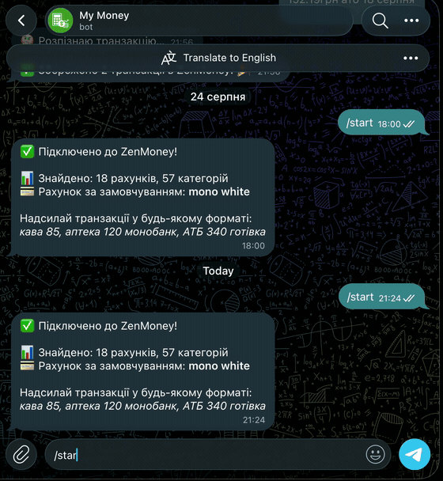

# ZenMoney Telegram Bot

A Telegram bot that turns a plain-language message like `кава 85, аптека 120 монобанк`
into structured financial transactions in [ZenMoney](https://zenmoney.ru/) — parsed by
**Claude Haiku**, confirmed with one tap, and written straight to the ZenMoney API.

No forms, no categories to pick, no app to open. You type how you'd tell a friend what you
spent; the bot figures out the amount, account, category, and merchant, shows you a
confirmation card, and saves it.

<p align="center">
  
</p>

---

## How Claude is used

The heart of the bot is a single Claude Haiku call that converts free-form Ukrainian text
into a validated JSON array of transactions ([`parser.py`](parser.py)):

```
"вчора кава 75 та бургер 180 монобанк"
        │
        ▼   Claude Haiku (claude-haiku-4-5)
[
  {"amount": 75,  "type": "expense", "account": null,       "category": "кофе", "date": "2026-09-02", ...},
  {"amount": 180, "type": "expense", "account": "монобанк", "category": "еда",  "date": "2026-09-02", ...}
]
```

The system prompt is given the user's **real accounts and category tree** at request time, so
Claude matches intent to the categories that actually exist ("кава" → `кофе`, "таксі" → `такси`),
resolves relative dates ("вчора" → yesterday), and splits one message into several transactions.
The result is parsed, validated, and sanitized before anything touches the user's money — and
every transaction is shown for confirmation before it's written.

Why Haiku: it's fast and cheap enough (~$0.25 / 1M input tokens) to run on every message while
still handling messy, mixed Ukrainian/Russian input reliably.

## Features

- 🗣️ **Natural-language input** — free-form text, Claude does the parsing
- 🧠 **Context-aware categories** — matched against your real ZenMoney category tree
- 🔁 **Multiple transactions per message** — `кава 85, аптека 120, АТБ 340 готівка`
- 💸 **Expenses, income, and transfers** between your own accounts
- ✅ **Confirm before save** — inline ✅ / ❌ buttons, nothing is written silently
- 💳 **Balances on demand** — `/accounts`
- 🔒 **Single-user whitelist** — every handler checks the Telegram user ID

## How it works

```
Telegram message
      │
      ▼
bot.py ──► parser.py ──► Claude Haiku        (text → structured transactions)
      │
      ▼
bot.py ──► zenmoney.py ─► ZenMoney Suggest   (fallback category by merchant)
      │
      ▼
confirmation card  ──(✅)──►  zenmoney.py ─► ZenMoney /v8/diff/   (write)
```

- **`bot.py`** — aiogram 3.x handlers, confirmation flow, amount/currency formatting
- **`parser.py`** — the Claude Haiku parser (prompt + JSON validation)
- **`zenmoney.py`** — async ZenMoney API client with atomic `state.json` caching

## Setup

### 1. Get the tokens

| Token | Where |
|-------|-------|
| Telegram Bot Token | [@BotFather](https://t.me/BotFather) |
| Your Telegram User ID | [@userinfobot](https://t.me/userinfobot) |
| ZenMoney Bearer Token | https://zerro.app/token |
| Anthropic API Key | https://console.anthropic.com |

### 2. Configure

```bash
cp .env.example .env
# open .env and fill in all four values
```

### 3. Install & run

```bash
pip install -r requirements.txt
python bot.py
```

Then message your bot: `/start`, then something like `кава 85`.

## Commands

| Command | Action |
|---------|--------|
| `/start` | Connect and do the first ZenMoney sync |
| `/accounts` | Show all accounts with current balances |
| `/refresh` | Re-sync accounts and categories from ZenMoney |

## Transaction formats

The bot understands, for example:

```
кава 85
кава 85, аптека 120 монобанк, АТБ 340 готівка
отримав зарплату 15000 монобанк
вчора кава 75 та бургер 180
переказав 500 з монобанку на готівку
```

## Project structure

```
zenmoney-bot/
├── bot.py            # Telegram handlers (aiogram 3.x) + confirmation flow
├── parser.py         # Claude Haiku NLP parser (text → transactions)
├── zenmoney.py       # ZenMoney API client (/v8/diff/, /v8/suggest/)
├── requirements.txt
├── render.yaml       # Render deploy blueprint
├── Procfile
├── .env.example      # Environment variables template
└── tools/            # One-off maintenance scripts (bulk statement import, dedupe)
```

`state.json` (the ZenMoney cache) and `.env` (secrets) are created locally and are
git-ignored — they never enter the repo.

## Technical notes

- **API**: ZenMoney `/v8/diff/` (read + write) and `/v8/suggest/` (category by merchant)
- **AI**: Claude Haiku (`claude-haiku-4-5`) via the Anthropic SDK
- **State**: `state.json` written atomically (`.tmp` → `rename`) so a crash can't corrupt it
- **Security**: `from_user.id` is checked in every handler against a whitelist
- **Deploy**: runs on [Render](https://render.com) as a long-polling worker with a small
  aiohttp health endpoint (`render.yaml` included)

> Note: the ZenMoney API (`api.zenmoney.ru`) is blocked in Ukraine, so the bot needs a VPN
> or a non-UA host to reach it. The bot's UI language is Ukrainian.

## License

[MIT](LICENSE)
